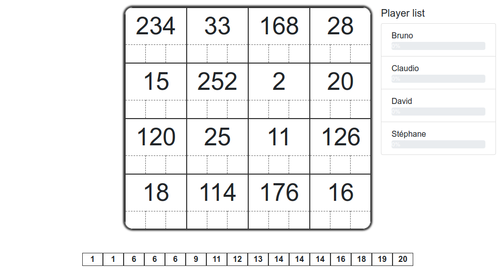

# Tetonor

Un jeu web multi-room et multi-joueur

Claudio Sousa, Janvier 2019

# Tetonor

{ height=300px }

_"Tetonor est un jeu innovant qui permet de se divertir tout en améliorant ses capacités de calcul mental et de raisonnement."_

# Projet Web

-   Réproduire le jeu sur des technologies web
-   Mais aussi...
    -   Multi-joueur
    -   Multi-room

# Architecture

#

## Gestion des parties

-   Gestion de plusieurs parties simultanées
-   Génération de jeux aléatoires
-   Calcul de l'avancement des joueurs
-   Machine à (_nombreux_) états

#

## Gestion des joueurs

-   Synchronization des joueurs d'une partie
-   Visualisation du score des joueurs en temps réel
-   Communications

#

## Intérations 1/2

{ height=550px }

#

## Intérations 2/2

{ height=550px }

# Nouveau jeu

#

## Attente de joueurs

# Liste de jeux

# Début du jeu

# Gameplay

# Démo

[http://bit.do/tetonor](http://bit.do/tetonor)

# Open source

Accès libre sur github:
_https://github.com/claudiosousa/tetonor_

# Conclusion

-   Webapp client-serveur
-   Tetonor multi-utilisateur
-   Hautement intéractive
-   Technos: Vue.js, websockets, node.js

# Q&A
