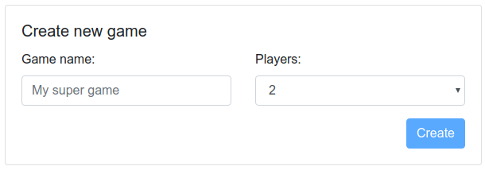
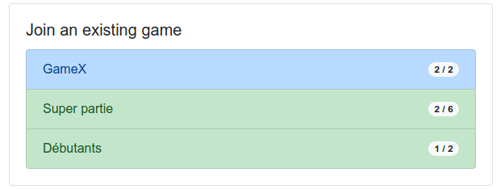

# Tetonor

Un jeu web multi-room et multi-joueur

Claudio Sousa, Janvier 2019

# Tetonor

{ height=300px }

_"Tetonor est un jeu innovant qui permet de se divertir tout en améliorant ses capacités de calcul mental et de raisonnement."_

# Projet Web

-   Réproduire le jeu sur des technologies web
-   Mais aussi...
    -   Multi-joueur
    -   Multi-room

# Architecture

# New game

# Waiting players

# List of games

# Game start

# Gameplay

# Intérations

{ height=550px }

# Démo

[http://u.nu/tetonor](http://u.nu/tetonor)

# Open source

Accès libre sur github:
_https://github.com/claudiosousa/tetonor_

# Q&A
